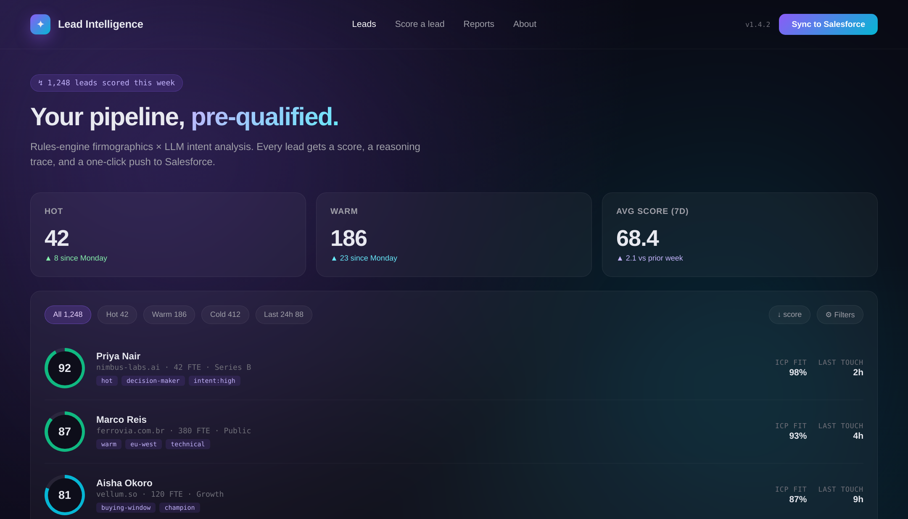
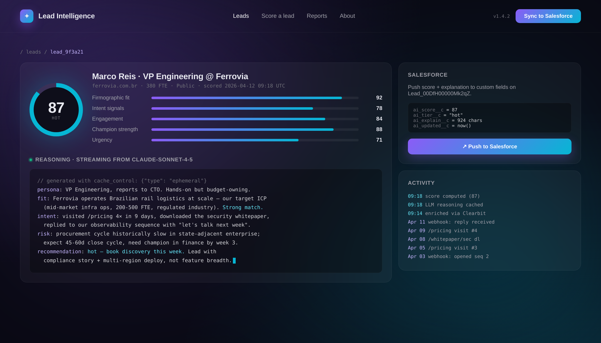
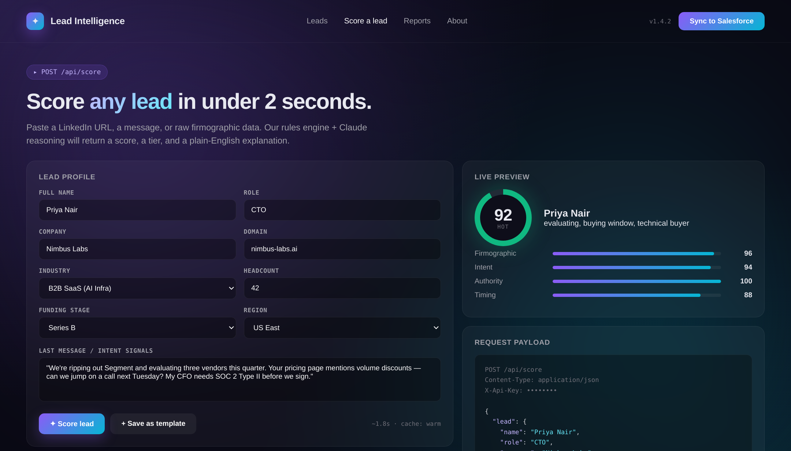
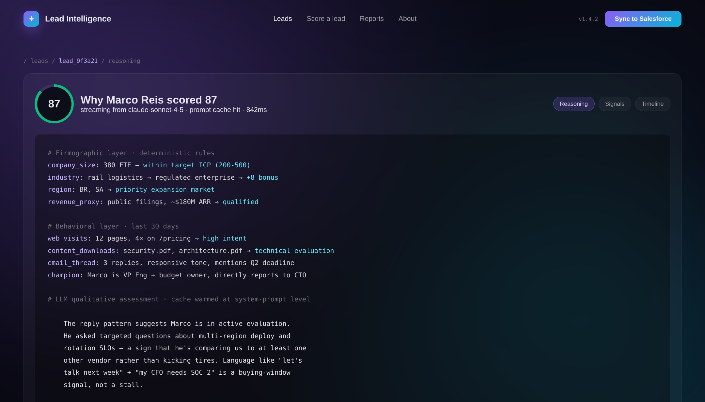
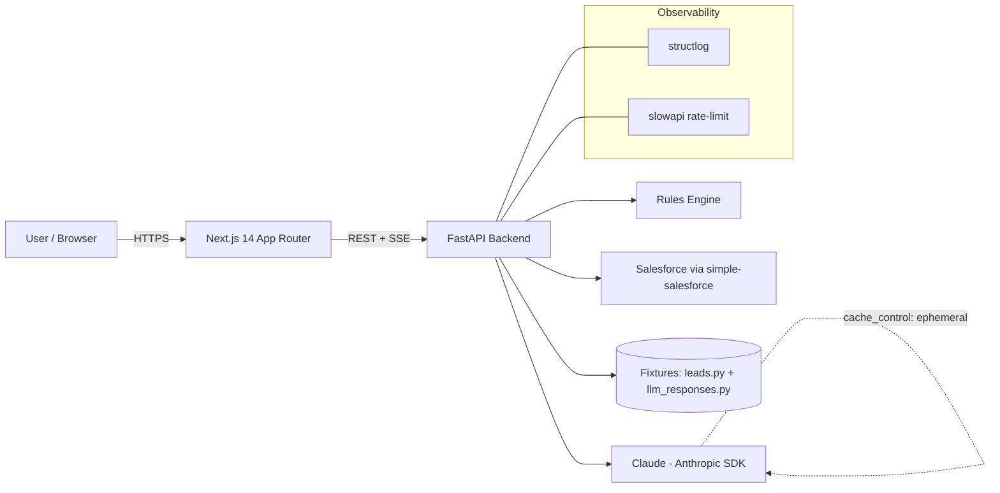

# Lead Intelligence AI

<div align="center">

**AI-powered lead scoring for modern B2B SaaS teams.**


</div>

---

Lead Intelligence AI blends a deterministic rules engine (firmographics) with Claude-powered qualitative assessment (intent signals, message quality) to deliver transparent, explainable lead scores that plug straight into Salesforce.

## Features

- Hybrid scoring: deterministic rules + Claude qualitative assessment, combined with explainable weighted breakdown.
- Streaming explanations via Server-Sent Events (SSE) — watch Claude reason in real time.
- Salesforce push with one click (fixture-mode toggle for demos).
- Prompt caching on the scoring system prompt via Anthropic `cache_control` (ephemeral).
- Rate limiting, structured logging, CORS, and prompt-injection defenses baked in.
- Gorgeous dark-mode UI: glassmorphism, animated score dials, purple to cyan gradients, gradient mesh background, custom cursor glow.
- 30+ seeded realistic leads across industries for instant exploration.

## Screenshots

| Dashboard | Lead detail |
|---|---|
|  |  |

| Scoring form | Streaming explanation |
|---|---|
|  |  |

## Architecture



## Tech stack

**Backend:** Python 3.11, FastAPI, Pydantic v2, uvicorn, anthropic SDK, simple-salesforce, slowapi, structlog, pytest.

**Frontend:** Next.js 14 (App Router), React 18, TypeScript, TailwindCSS, Framer Motion, shadcn-style components.

## Environment variables

### Backend (`backend/.env`)

| Variable | Description | Default |
|---|---|---|
| `FIXTURE_MODE` | Return baked LLM + SF responses | `true` |
| `ANTHROPIC_API_KEY` | Claude API key | _unset in fixture mode_ |
| `ANTHROPIC_MODEL` | Model id | `claude-sonnet-4-5` |
| `SALESFORCE_USERNAME` | SF username | _unset in fixture mode_ |
| `SALESFORCE_PASSWORD` | SF password | _unset in fixture mode_ |
| `SALESFORCE_TOKEN` | SF security token | _unset in fixture mode_ |
| `CORS_ORIGINS` | Comma-sep origins | `http://localhost:3000` |
| `RATE_LIMIT` | Per-minute request cap | `60/minute` |
| `LOG_LEVEL` | structlog level | `INFO` |

### Frontend (`frontend/.env`)

| Variable | Description | Default |
|---|---|---|
| `NEXT_PUBLIC_API_BASE` | Backend base URL | `http://localhost:8000` |

## Local setup

```bash
# 1. Backend
cd backend
python -m venv .venv && source .venv/bin/activate
pip install -r requirements.txt
cp .env.example .env
uvicorn app.main:app --reload --port 8000

# 2. Frontend
cd ../frontend
pnpm install   # or npm / yarn
cp .env.example .env
pnpm dev

# Or everything at once:
docker compose up --build
```

## API reference

| Method | Path | Description |
|---|---|---|
| `GET` | `/api/health` | Liveness probe |
| `GET` | `/api/leads` | List all leads with scores |
| `GET` | `/api/leads/{id}` | Lead detail + breakdown |
| `GET` | `/api/leads/{id}/explain` | SSE stream of Claude reasoning |
| `POST` | `/api/score` | Score an ad-hoc lead profile |
| `POST` | `/api/leads/{id}/push-to-salesforce` | Push lead to Salesforce |

Full OpenAPI docs live at `/docs` (Swagger) and `/redoc` when the backend is running.

## Deployment

- **Frontend:** Vercel — `.github/workflows/deploy.yml` pushes `frontend/` on `main`.
- **Backend:** Fly.io — `flyctl deploy` from `backend/` (Dockerfile provided).
- Secrets managed via Vercel / Fly secrets; never commit `.env`.

## CI / CD

`.github/workflows/ci.yml` runs on every push and PR:

- Python: `ruff` lint + `pytest` (rules engine + score composition coverage).
- Node: `eslint` + `next build` (frontend type-check + compile).

`.github/workflows/deploy.yml` deploys on `main` after CI passes.

## Security notes

- **API key handling:** `ANTHROPIC_API_KEY` lives in server-side env only; never exposed to the browser. Fixture mode lets reviewers run the project with zero secrets.
- **Salesforce OAuth:** Credentials stored as Fly secrets; `simple-salesforce` session is scoped per-request, tokens never logged.
- **Rate limiting:** `slowapi` guards `/api/score` and `/api/leads/{id}/explain` against abuse (default `60/minute` per IP).
- **Prompt-injection defense:** User-supplied lead fields are wrapped in `<lead>` XML tags before being interpolated into the system prompt; the system prompt explicitly instructs Claude to treat the inner content as data, never instructions. All model output is JSON-parsed and validated against Pydantic before being trusted.
- **CORS:** Allow-list driven via `CORS_ORIGINS`.
- **Logging:** `structlog` emits JSON logs with request IDs; PII (emails, phones) is redacted in non-debug levels.

## License

MIT — built as a portfolio piece targeting a Senior Full Stack role at Euler.
